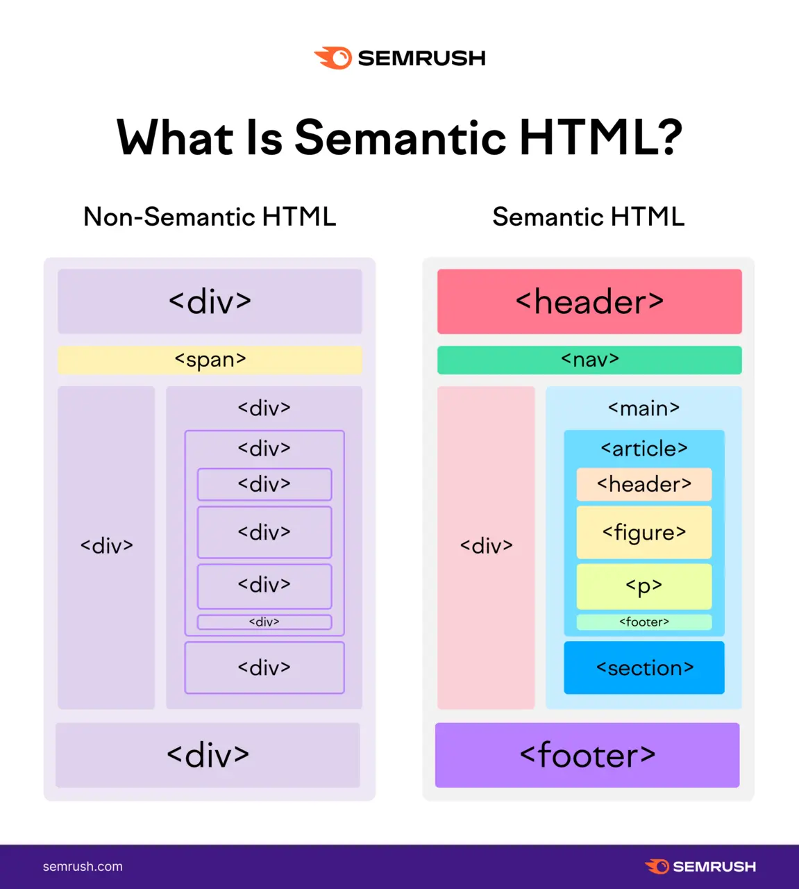
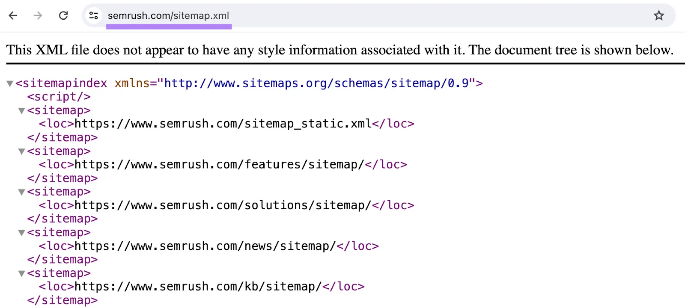
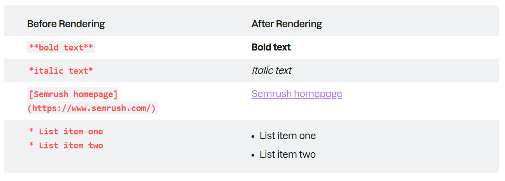
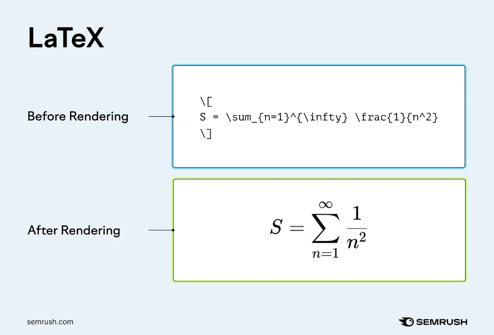

# What is a Markup Language?

A markup language is a system for defining the structure, presentation, and/or purpose of content within a digital document so computer programs can interpret and display the content correctly.

Markup languages encode text using specific vocabulary, symbols, and/or syntax rules.

i.e. `<h1>` - top-level-heading

**Markup languages can:**

- Make your website more search engine-friendly
- Ensure your content displays consistently across different technologies
- Improve website 

## Markup Languages vs. Programming Languages

Markup languages and programming languages are both types of computer languages used to structure, display, and manipulate content or data—**but they aren’t the same thing**.

Programming languages provide logic that computers can execute. This enables the program to react to inputs, perform calculations, make decisions, and complete tasks.

For example, you can program a button to change color when a user hovers on it.

In contrast, markup languages can only define an element's structure and appearance at the time it’s loaded. Markup cannot change an element’s state or behavior dynamically.

Python, JavaScript, and PHP are examples of programming languages.

## Types of markup Language

**Semantic markup** (or descriptive markup) provides meaning to content by labeling that content’s structure and purpose. Which can help browsers, search engines, and developers interpret the content correctly.

For example, in XML, `<author>John Doe</author> `identifies "John Doe" as the author of an article. But the markup doesn’t affect the presentation of this text.

**Presentational markup** controls the visual appearance of content so users see content in a specific way. This markup defines how the text should look without specifying how the system should render it.

For example, in HTML, `<b>Bold Text</b>` marks the enclosed text as bold but doesn’t dictate the exact process the browser should use to achieve that appearance.

**Procedural markup** provides step-by-step commands for how content should be processed, formatted, or displayed. Instead of defining appearance, this markup directs the system on what to do with the text.

For example, In LaTeX, `\textbf{Bold Text}` instructs the typesetting system to apply a bold font weight based on its backend processing rules.

## 7 Markup Language Examples


### 1. HTML

  HTML is the standard markup language used to structure and organize content on webpages.

  The latest version of HTML is called HTML5.

  You define elements in an HTML document by enclosing content in HTML tags. 

Like these:

- `<p>` tags for paragraphs
- `<a>` tags for hyperlinks
- `` tags for images
- `<h1>` tags for top-level headings
- `<title>` tags for page titles

You can also use semantic HTML to label different parts of your page—e.g., the header, navigation menu, and footer. This helps search engines, assistive technologies (like screen readers), and developers understand your content’s purpose.




### 2. XML

XML (extensible markup language) is used for storing and transporting data.

This markup language is important in SEO because SEO professionals use it to create XML sitemaps.

Your XML sitemap should list all the pages on your site you want search engines to index (i.e., add to the database of possible search results). The XML format helps search engine crawlers read the file.



### 3. Markdown

Markdown is a lightweight markup language that uses symbols to format text in a plain-text editor. 

The language’s simple syntax makes it ideal for quick formatting and easy readability across different environments.



Markdown is widely supported across word processors, instant messaging apps, online forums, documentation tools, note-taking applications, developer platforms, blogging sites, and project management tools.

Some platforms, such as Reddit and GitHub, use their own versions of markdown.

### 4. SVG

SVG (Scalable Vector Graphics) is a markup language used to describe vector graphics.

Vector graphics are images created from mathematical equations. This means they can only be used for relatively simple graphics, but these graphics can be resized without losing quality.

For example, the SVG code below creates a blue circle that takes up 80% of the smallest side of its container and is centered in the container.

`<svg viewBox="0 0 100 100" width="100%" height="100%" xmlns="http://www.w3.org/2000/svg">
    <circle cx="50" cy="50" r="40" fill="blue" />
</svg>`

<svg viewBox="0 0 100 100" width="100%" height="100%" xmlns="http://www.w3.org/2000/svg">
    <circle cx="50" cy="50" r="40" fill="blue" />
</svg>
SVG images remain sharp at any size and typically load faster than raster graphics (such as JPEGs and PNGs). This makes SVG a good choice for logos, icons, charts, and other simple graphics.

### 5. LaTeX

LaTeX is a procedural markup language generally used to prepare scientific papers, research articles, and mathematical content—usually in a PDF format.

The language allows users to display complex equations with proper notation, like this:



LaTeX also makes handling citations, bibliographies, footnotes, and other elements that can be challenging to manage in other markup languages easier.

### 6. SGML

SGML (standard generalized markup language) is a framework for creating markup languages—it was the foundation for HTML and XML.

To start with SGML, craft a Document Type Definition (DTD). The DTD outlines the document structure and lists the elements, attributes, and entities you will use.

You can then write your document according to these established guidelines.

Here’s a brief example:

```
<!DOCTYPE book [
    <!ELEMENT book (title, chapter+)>
    <!ELEMENT title (#PCDATA)>
    <!ELEMENT chapter (#PCDATA)>
]>
<book>
    <title>Sample SGML Document</title>
    <chapter>Introduction to SGML</chapter>
</book
```

Today, most developers prefer to use HTML or XML instead of SGML. Because HTML and XML are more user-friendly and widely supported.

### 7. XHTML

XHTML is a blend of HTML and XML that merges HTML’s presentation features with XML’s strict syntax rules.

XHTML was developed to improve code and browser compatibility. But many of these improvements became redundant with the introduction of HTML5.

Most developers now use HTML5 over XHTML due to HTML5’s adaptability and ability to keep up with the evolving digital landscape.