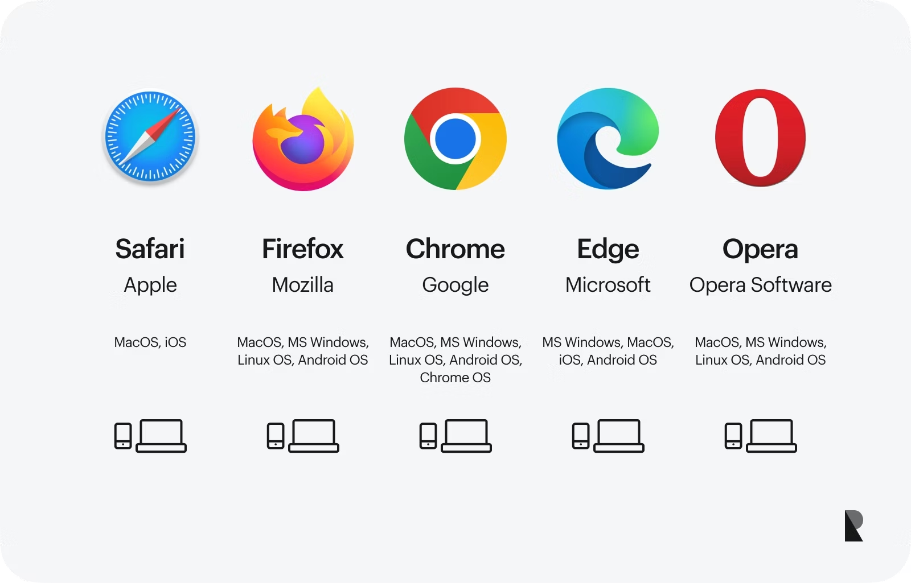
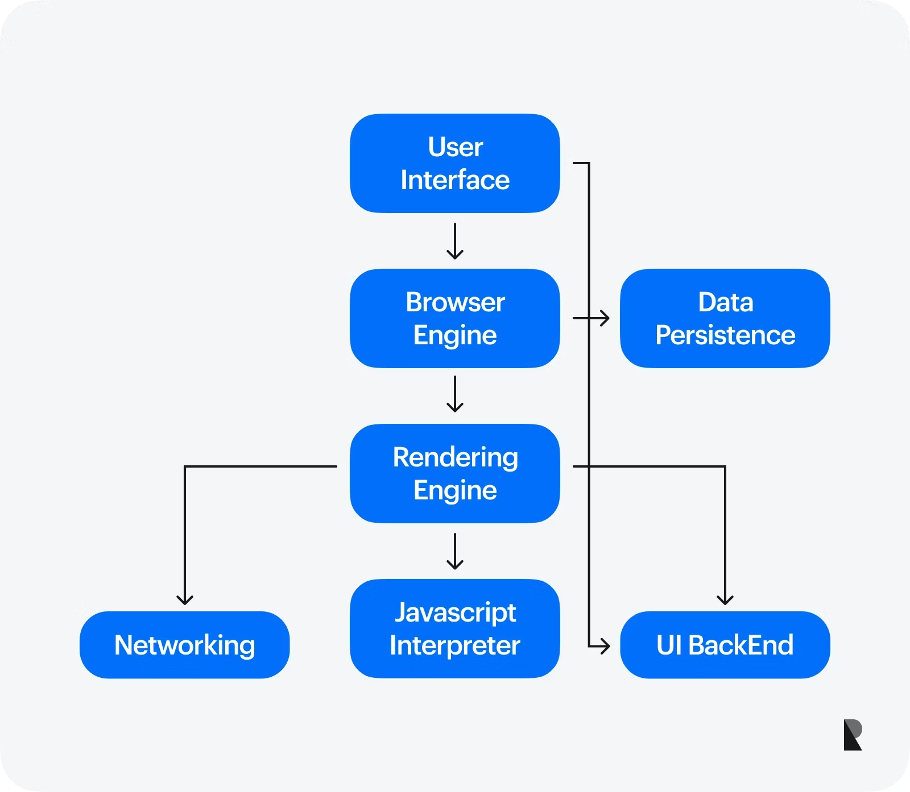

# What is web browser?

A software application that retrieves, interprets, and displays web content, allowing users to access websites and web applications via the internet using protocols like HTTP and HTTPS.

A web browser is a software program that enables a user to access information on the Internet via the World Wide Web.

# How a Web Browser Works?

A breakdown of how a web browser converts behind-the-scenes technical jargon into a user-friendly experience.

## Rendering Engine - The Web Architecture

It is the main component of a web browser that converts the website code into visual elements visible on a web page. The rendering engine receives instructions from a browser, interprets them, and builds a webpage accordingly. Following are the rendering engines used by mainstream browsers:

- **Blink**: This engine powers Google Chrome and is known for its speed and efficiency.
- **WebKit**: Used in Safari (Apple devices) and other browsers, WebKit offers robust features for rendering complex webpages.
- **Gecko**: The engine behind Mozilla Firefox prioritizes open-source development and standards compliance.

## Browser Components

While the rendering engine plays a central role in the working of a web browser, multiple other components bring to you any web page you access via the internet. Some key components include:

- **User Interface (UI)**: You interact with it directly. It includes the address bar, where you enter website addresses, the back and forward buttons for navigation, and the tabs that allow you to open multiple websites simultaneously.
- **Rendering Engine**: As discussed, the architect is responsible for building the visual representation of the webpage.
- **Networking Component**: It fetches website files (code, images, videos) from web servers worldwide, ensuring all the necessary pieces are delivered to the rendering engine to build the web page.
- **JavaScript Engine**: It interprets and executes JavaScript code, allowing webpages to respond to user actions and create dynamic experiences.
- **Security Components**: They handle tasks like encrypting data transmissions (HTTPS) and protecting you from malicious websites.

## Hypertext Transfer Protocol Secure (HTTPS)

This protocol encrypts all data exchange occurring on a web browser. It ensures the privacy of important information like login credentials, credit card information, or personal data. Modern browsers visually indicate secure connections with a padlock symbol in the address bar and https:// at the beginning of the URL.
