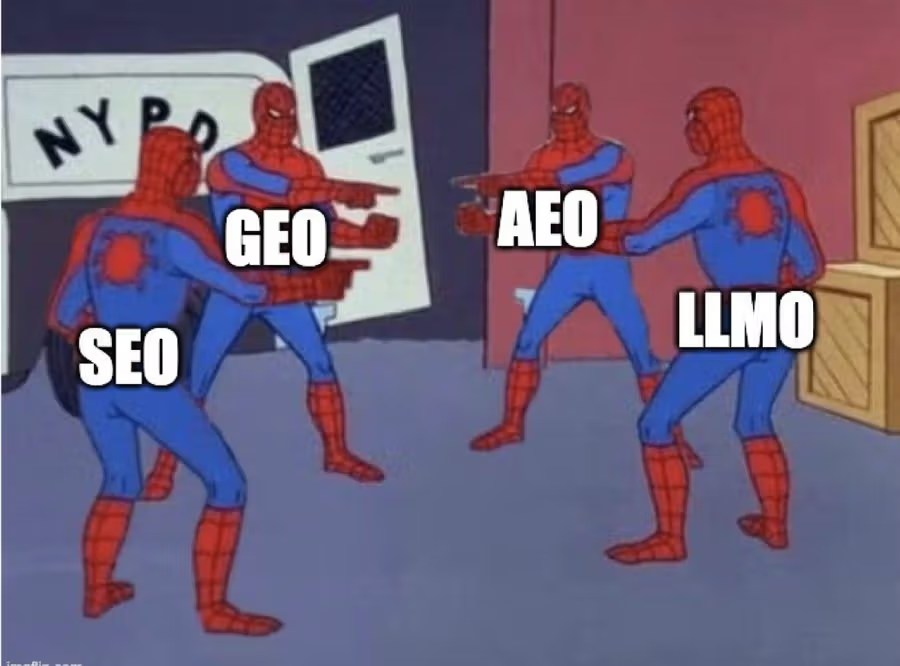

# Search Engine Optimization (SEO)

Search Engine Optimization, or SEO, is the practice of improving your website to increase its visibility when people search for products or services related to your business in search engines like Google. The better visibility your pages have in search results, the more likely you are to garner attention and attract prospective and existing customers to your business. A related concept, Generative Engine Optimization (GEO), focuses on optimizing content for AI-powered search experiences, ensuring your information is accurately and effectively presented in AI-generated summaries and responses.

Search engine optimization (SEO) is the practice of improving your website so it ranks higher in traditional search results from Google, Bing, and other search engines. The goal is to drive organic, unpaid traffic by matching what people search for with content they can click through to.

**The core SEO techniques include:**

* Keyword research and search intent analysis
* On-page optimization (titles, headings, content)
* Technical SEO (site speed, crawlability, schema)
* Building backlinks from trusted domains
* Internal linking and topical authority

SEO has been the default discovery strategy for two decades because, until recently, search engines were the front door to the web.

## What is GEO?

Generative engine optimization (GEO) is the practice of optimizing your content and brand so AI-powered search engines like ChatGPT, Gemini, and Perplexity cite or reference you inside their generated answers. The goal isn't a click. It's being the source the AI synthesizes from.

The core GEO techniques include:

* Writing direct, factual answers AI can extract cleanly
* Structuring content for machine parsing (clear hierarchy, bullets, FAQs)
* Building entity recognition through consistent brand mentions across the web
* Earning third-party citations on Reddit, forums, news, and review sites
* Tracking citation frequency and share of voice across AI platforms

Now, there are enough people debating whether to call it GEO, AEO, LLMO, or just SEO. But the acronym doesn’t really matter as long as you understand you are optimizing content for AI search as well.

